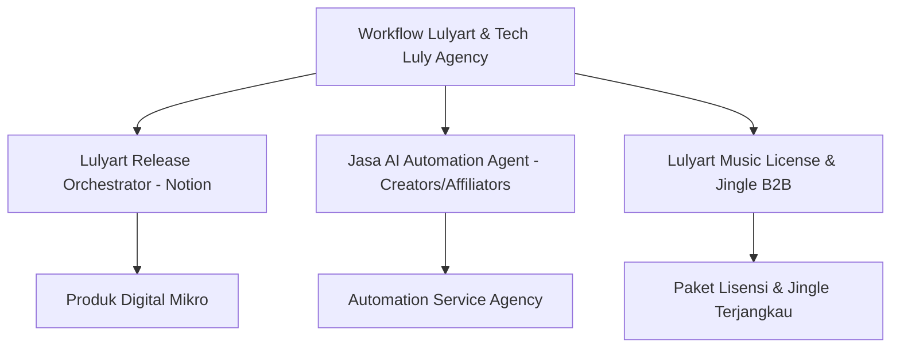

# LULY AGENCY: STRATEGIC GROWTH & PRODUCT BLUEPRINT
*Integrasi Sinergis Lulyart (Digital Music) & Luly Agency (AI Agents, Automation, & Sonic Branding)*

---

## 1. POSITIONING & VALUE PROPOSITION

### Menghubungkan Rekam Jejak Lulyart ke Kredibilitas Luly Agency
Pasar produk digital untuk UMKM dan kreator sudah jenuh dengan template dan tools generik yang dibuat oleh pihak ketiga tanpa pengalaman praktis. Kekuatan utama **Luly Agency** adalah statusnya sebagai **"dibuat oleh kreator, untuk kreator"**, dengan bukti nyata (social proof) dari kesuksesan operasional **Lulyart**.

#### Hook Utama (Pesan Inti)
> **"Kami tidak menjual teori produktivitas atau AI hype. Kami menjual sistem automasi dan jingle legal yang terbukti meluncurkan album indie Lulyart ke kancah global secara mandiri."**
> 
> *Rasional*: Memposisikan Luly Agency bukan sekadar agensi digital biasa, melainkan partner taktis yang membagikan "operational blueprint" dan sistem automasi dari brand musik independen aktif (Lulyart) dengan katalog rilis ril seperti single *'Fatamorgana Cinta'* dan album *'Perempuan Mandiri'*.

### Tagline Utama (Sinergi Audio-Visual, AI & Solusi Digital)
Kami merumuskan tiga opsi tagline taktis berdasarkan target audiens spesifik:

| Target Audiens | Tagline Utama | Fokus Pesan |
| :--- | :--- | :--- |
| **Kreator & Musisi (B2C)** | `"Harmoni Kreatif, Eksekusi Digital: Melodi untuk Brand Anda, Sistem untuk Produktivitas Anda."` | Sinergi kualitas audio Lulyart dengan fungsionalitas sistem Luly Agency. |
| **UMKM & Afiliator (B2B/B2C)** | `"Konten Jalan Sendiri, Omzet Auto-Pilot."` | Menjual kepraktisan sistem automasi AI Agent & Audio Branding instan. |
| **Global/SaaS Vibe** | `"Symphony in Sound, Efficiency in Tech & AI."` | Karakter modern, clean, dan profesional berstandar internasional. |

---

## 2. STRATEGI MVP & PENAWARAN PRODUK PERTAMA (GTM)

Untuk mempercepat *Time-to-Market*, Luly Agency meluncurkan produk dalam 3 pilar: **Micro-Tools**, **B2B Jasa AI Agent Automation**, dan **Paket Lisensi Musik & Jingle UMKM Hemat**.



### A. 2 Produk Digital Mikro (Micro-Tools)
1.  **"Lulyart Release Orchestrator" (Template Notion)**:
    *   *Deskripsi*: Sistem manajemen rilis musik komprehensif. Dari tracking demo, pendaftaran agregator (DistroKid/Netrilis), checklist promosi H-30 hingga H+30, hingga tracking royalti & playlist pitching.
    *   *Model Bisnis*: Freemium (Basic gratis untuk lead magnet, Pro Rp49.000 sekali bayar).
2.  **"Sonic Branding & Social Media Kit" (Template Canva + Notion)**:
    *   *Deskripsi*: Template visual visualizer audio dengan skema warna estetik lo-fi/neon serta panduan optimasi algoritma suara di media sosial.
    *   *Model Bisnis*: Paid Only (Rp79.000 sekali beli, dipromosikan lewat bundling gratis jika membeli Template Notion Pro).

---

### B. Jasa AI Agent Automation (Untuk Kreator, Afiliator, & Korporat)
Layanan automasi pintar untuk mereduksi jam kerja operasional konten kreator dan UMKM menggunakan teknologi AI Agent.

| Target Segmen | Solusi AI Agent | Manfaat Utama |
| :--- | :--- | :--- |
| **Konten Kreator** | **Creator Auto-Pilot Agent**<br>- Riset tren konten otomatis harian.<br>- Pembuatan script video (pancingan hook 3 detik).<br>- Auto-scheduling & posting multi-platform. | Kreator hanya perlu fokus rekaman (shooting); AI mengurus riset, copywriting, SEO, dan upload. |
| **Afiliator** | **Affiliate Cash-Flow Agent**<br>- Pemindaian produk komisi tinggi yang sedang tren.<br>- Auto-generate video promosi slide-show dari review pembeli.<br>- Auto-comment link afiliasi setiap kali ada audiens bertanya di kolom komentar. | Meningkatkan penjualan produk afiliasi 24/7 tanpa harus stand-by membalas komentar secara manual. |
| **Korporat / UMKM B2B** | **Enterprise Lead-Gen Agent**<br>- Chatbot CRM pintar yang dilatih dengan knowledge base produk.<br>- Auto-replies untuk DM/komentar bertanya harga.<br>- Menyinkronkan leads prospek ke Notion/Google Sheets secara real-time. | Mencegah kebocoran leads karena admin lambat membalas pesan. Respon instan <10 detik. |

---

### C. Desain Penawaran Harga Paket Lisensi Musik Lulyart & Jingle UMKM
Skema harga baru yang sangat terjangkau, dirancang untuk memicu pembelian impulsif (impulsive buying) dengan diskon besar-besaran, serta legalitas aman 100% dari *copyright strike*.

```
[PRICING PLAN]
 ├── LITE LICENSE (Katalog Lulyart)  : Rp 200.000   (Diskon dari Rp 500.000)
 ├── CUSTOM JINGLE LITE              : Rp 499.000   (Diskon dari Rp 1.200.000)
 └── PREMIUM JINGLE + AUTOMATION     : Rp 1.199.000 (Diskon dari Rp 3.000.000)
```

#### 1. Paket LITE: Lisensi Lagu Katalog Lulyart (Terlaris untuk UMKM)
*   **Harga Normal**: ~~Rp 500.000~~ | **Harga Promo Diskon**: **Rp 200.000**
*   **Apa yang Didapat?**:
    *   Hak guna (lisensi komersial) salah satu lagu dari katalog aktif Lulyart (contoh: *Fatamorgana Cinta* atau instrumen dari album *Perempuan Mandiri*).
    *   Bisa digunakan hingga 10 video promosi produk UMKM Anda.
    *   Bebas royalti seumur hidup (lifetime royalty-free) di platform TikTok, Instagram Reels, dan YouTube Shorts.
    *   *Sertifikat Lisensi Digital resmi dari Luly Agency & Lulyart.*

#### 2. Paket MEDIUM: Custom Jingle Lite (Identitas Suara Unik)
*   **Harga Normal**: ~~Rp 1.200.000~~ | **Harga Promo Diskon**: **Rp 499.000**
*   **Apa yang Didapat?**:
    *   Pembuatan **Jingle Musik Orisinal (15 Detik)** bertema lo-fi/akustik ceria sesuai karakter brand Anda.
    *   **Sonic Logo / Stinger (3 Detik)** untuk intro & outro video.
    *   Lisensi eksklusif 100% milik brand Anda.
    *   *Bonus*: Template Notion "Lulyart Release Orchestrator" versi Pro gratis.

#### 3. Paket PREMIUM: Jingle Pro + Automation Integration
*   **Harga Normal**: ~~Rp 3.000.000~~ | **Harga Promo Diskon**: **Rp 1.199.000**
*   **Apa yang Didapat?**:
    *   Pembuatan **Custom Jingle Lengkap dengan Vokal (30-60 Detik)**.
    *   Pengembangan & Pemasangan **1 Setup Automasi AI Agent Basic** (misalnya, auto-reply link jualan di Instagram/TikTok saat audiens berkomentar "mau").
    *   Konsultasi Sonic Branding & AI Strategy selama 1 jam dengan tim Luly Agency.

---

## 3. STRATEGI ALGORITMA FYP TIKTOK TERBARU & AUTOMATION SEO

Algoritma FYP TikTok terbaru menekankan pada **Search Intent** (Niat Pencarian) dan **Retention Time** (Waktu Tonton). TikTok kini berfungsi sebagai mesin pencari layaknya Google bagi Gen Z.

### A. Strategi Algoritma FYP & SEO TikTok
Untuk menembus FYP dan memuncaki kolom pencarian TikTok, Luly Agency menerapkan pilar taktis berikut:

1.  **Optimization Spoken Words (SEO Suara)**: AI TikTok melakukan transkripsi otomatis terhadap apa yang diucapkan di dalam video. Kata kunci utama wajib diucapkan di 3 detik pertama (misalnya: *"Cara automasi konten"* atau *"Lagu jingle UMKM"*).
2.  **On-Screen Text Matching**: Gunakan teks di dalam video (bukan teks bawaan edit eksternal, melainkan teks yang mudah terbaca sistem TikTok) yang mengandung keyword relevan.
3.  **High Retention Loop (Visual Hook)**: Jaga durasi video pendek berkisar 15-30 detik dengan visual dinamis yang berubah setiap 2 detik sekali untuk menjaga audiens tidak melakukan *swipe*.

### B. Formula Template Optimasi SEO, Niche, Caption, & Tags

Gunakan formula template penulisan konten berikut untuk memastikan konten auto-index di mesin pencari TikTok:

#### Formula Caption Terbaik (Hook + Value + CTA + Keyword Rich)
```text
[Hook Menarik] + [Penjelasan Singkat Solusi/Value] + [Interaksi/CTA]
```
*Contoh Caption*:
> "Capek balas DM nanya harga satu-satu? 🥱 Sistem AI Agent dari Luly Agency ini otomatis kirim link jualan ke calon pembeli pas mereka komen 'Mau'. Gak perlu admin stand-by 24 jam! Cek cara lengkapnya di bio ya. 👇"

#### Pemilihan Tags & Hashtags (Struktur 4 Pilar)
Gunakan kombinasi hashtags terstruktur berikut (hindari hashtag sampah seperti `#FYP` atau `#viral`):
1.  **Niche Utama (2 Tags)**: `#AIAgent` `#AutomasiKonten`
2.  **Solusi/Topik Khusus (2 Tags)**: `#TikTokMarketing` `#SolusiUMKM`
3.  **Brand (1 Tag)**: `#LulyAgency`
4.  **Target Keyword SEO (1 Tag)**: `#CaraJualanAutoPilot`

#### Kerangka Penentuan Niche
*   **Niche Utama**: Solusi Digital & Automasi Kreatif (Tech-Creative Hub).
*   **Sub-Niche**: AI Agent untuk Efisiensi Bisnis Mikro (UMKM) & Manajemen Rilis Musisi Independen.

---

### C. Sistem Pipeline Automasi Konten Kreator & Afiliator
Berikut adalah alur automasi SEO, Caption, dan Tags yang dapat digunakan secara internal atau dijual sebagai jasa oleh Luly Agency:

```text
[Riset Tren Niche] ──> [AI Agent Generate Script & Caption SEO] ──> [Auto-Publish & Scheduler] ──> [Auto-Reply Bot Komentar Link Produk]
```

1.  **Riset Trend & Keyword Otomatis**: AI Agent memantau tren keyword pencarian tinggi di Google Trends & TikTok Search.
2.  **Auto-Generator Script**: Menghasilkan naskah video pendek dengan teknik copywriting *AIDA (Attention, Interest, Desire, Action)* yang sudah disisipi keyword SEO.
3.  **Auto-Publish**: Mengirimkan draf konten terjadwal ke TikTok, Reels, dan Shorts secara serentak.
4.  **Auto-Reply Links**: Ketika konten viral dan audiens berkomentar keyword pemicu (contoh: "mau template"), AI Agent otomatis membalas komentar dengan menyematkan link afiliasi atau link checkout Luly Agency.

---

## 4. 3 KONSEP KONTEN VIDEO PENDEK (BTS TO CTA)

### Konsep 1: "Cara Saya Merilis Lagu ke Spotify Tanpa Label Rekaman"
*   **Niche**: Edukasi Industri Musik & Produktivitas.
*   **SEO Keywords**: *Cara rilis lagu, rilis lagu Spotify, musik indie Indonesia.*
*   **Visual**: Tangan menekan tombol play di DAW memutar lagu 'Fatamorgana Cinta', lalu transisi layar ke template Notion *Lulyart Release Orchestrator*.
*   **Script / Voice Over**:
    > "Gak punya label rekaman tapi lagu bisa masuk Spotify Editorial Playlist? Ini rahasia saya merilis lagu *Fatamorgana Cinta* secara mandiri. Semua aset promosi, jadwal rilis, sampai pitching playlist saya kelola pakai template Notion ini. Supaya rapi dan gak ada yang kelewat."
*   **Caption**:
    > Mau rilis lagu sendiri ke Spotify tanpa ribet salah metadata? 🎵 Template "Lulyart Release Orchestrator" ini bantu rapiin workflow rilis musikmu dari H-30. Ambil gratis di link bio! 👇 #RilisLagu #MusikIndie #LulyAgency #NotionTemplate #MusisiIndie
*   **Hashtags**: `#RilisLagu` `#MusikIndie` `#LulyAgency` `#NotionTemplate` `#MusisiIndie`

### Konsep 2: "Bisnis Kena Denda Karena Asal Pakai Lagu Viral? Ini Solusinya!"
*   **Niche**: Edukasi Hukum Bisnis & Digital Marketing UMKM.
*   **SEO Keywords**: *Jingle jualan, musik komersial bebas hak cipta, jingle UMKM murah.*
*   **Visual**: Menunjukkan notifikasi klaim hak cipta musik di Reels akun bisnis yang di-mute, lalu transisi ke rekaman studio Lulyart sedang mengaransemen jingle orisinal.
*   **Script / Voice Over**:
    > "Awas, akun bisnis dilarang pakai lagu viral sembarangan kalau gak mau video promosi di-mute karena hak cipta. Solusinya, bisnis kamu butuh audio logo atau jingle orisinal yang legal. Di Luly Agency, kamu bisa dapetin lisensi musik katalog aktif Lulyart atau custom jingle mulai dari 200 ribu aja!"
*   **Caption**:
    > Jangan biarkan video iklan bisnismu di-mute karena masalah hak cipta! 🔇 Dapatkan lisensi musik orisinal aman & legal dari katalog Lulyart mulai dari Rp200.000 saja. Cek diskon paketnya di bio! #JingleUMKM #LisensiMusik #AudioBranding #LulyAgency #PromosiBisnis
*   **Hashtags**: `#JingleUMKM` `#LisensiMusik` `#AudioBranding` `#LulyAgency` `#PromosiBisnis`

### Konsep 3: "Kerjaan 5 Jam Selesai 5 Menit: Trik Rahasia Afiliator Sukses"
*   **Niche**: Automasi AI & Tips Cari Uang Online.
*   **SEO Keywords**: *Cara kerja AI Agent, automasi konten afiliasi, trik FYP TikTok.*
*   **Visual**: Montase layar laptop menunjukkan kode/workflow automasi berjalan otomatis, membalas puluhan komentar calon pembeli dengan link afiliasi secara instan.
*   **Script / Voice Over**:
    > "Gimana caranya afiliator top bisa posting puluhan video sehari dan balas ratusan komen yang nanya link produk? Jawabannya bukan kerja lembur, tapi pakai AI Agent Automation. Sistem ini yang mendeteksi komentar nanya harga, lalu otomatis balas pakai link produk kamu secara instan."
*   **Caption**:
    > Stop balas komentar manual satu per satu! 🤖 Biarkan AI Agent Luly Agency yang bekerja membalas komentar pembeli dan menaruh link afiliasimu secara otomatis 24 jam nonstop. Konsultasi automasimu di link bio! #AIAgent #AutomasiAfiliator #CariUangOnline #LulyAgency #TikTokAffiliate
*   **Hashtags**: `#AIAgent` `#AutomasiAfiliator` `#CariUangOnline` `#LulyAgency` `#TikTokAffiliate`

---

## 5. DETAIL PROMPT GENERATOR UNTUK ASPEK VISUAL (Aesthetic Brand)

### Prompt 1: Landing Page Hero Banner (Cyberpunk-Lo-Fi Music Studio & Clean Tech)
> `A professional and clean landing page hero section background, depicting a modern music producer's desk combined with a sleek SaaS productivity dashboard layout. On the desk: high-tech studio monitors, a glowing MIDI keyboard, and a futuristic laptop. In the background: glowing neon violet and cyberpunk cyan ambient strip lights, warm lo-fi interior, dark wooden acoustic diffuser panels. Floating transparent 3D glassmorphic cards displaying clean UI user interfaces, progress bars, and audio waveform widgets. Ultra-realistic, architectural lighting, depth of field, Octane render, 8k resolution, dark mode aesthetic --ar 16:9 --style raw`

### Prompt 2: Product Mockup Showcase (Notion & Canva Templates Display)
> `A premium mock-up showcase of a tablet and laptop screen displaying a clean productivity Notion workspace template on a dark wooden studio table. Next to the screens is a glowing warm desk lamp, a dynamic microphone on a boom arm, and a sleek coffee mug. Soft lo-fi lighting, neon purple and indigo ambient backlight, clean tech aesthetic, cinematic composition, depth of field, shot on 50mm lens --ar 4:3 --v 6.0`

### Prompt 3: B2B Audio Branding Pitch Presentation Visual
> `A minimalist corporate high-end abstract design, digital waves merging into sound waves, transforming into clean geometric growth charts. Elegant dark mode, royal indigo, deep magenta, and neon cyan gradient colors. Glassmorphism textures, clean technology elements, premium business presentation slide background, clean, empty space for text placement, professional studio quality --ar 16:9`

---

### Aset Visual Terpilih (Landing Page Hero Mockup)
*Representasi visual landing page Luly Agency yang memadukan estetika studio lo-fi & dashboard teknologi:*


---
> [!IMPORTANT]  
> **Langkah Taktis Segera (Actionable Next Steps)**:
> 1. **Setup Lead Capture**: Konfigurasi landing page / link bio dengan form diskon jingle & pendaftaran penawaran jasa automasi AI Agent.
> 2. **Pre-sales Catalog**: Kemas 3 lagu katalog utama Lulyart dalam format file resolusi tinggi beserta surat lisensi penggunaan standar untuk UMKM yang membeli paket Rp200.000.
> 3. **Draft Campaign Konten**: Mulai produksi konten menggunakan formula TikTok SEO & Hashtag di atas, rilis 1 video per hari untuk melatih algoritma akun Anda.
