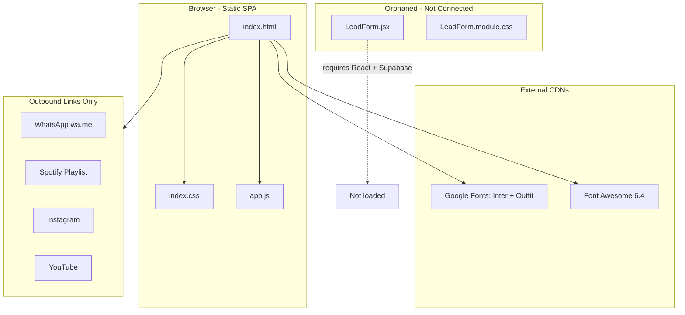
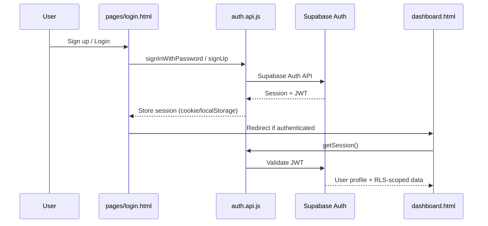

# Luly Agency project analysis
_Exported on 7/9/2026 at 09:42:46 GMT+7 from Cursor (3.10.20)_

---

**User**

Analyze the whole Luly Agency project.

Current stack:
- HTML
- CSS
- JavaScript
- Supabase
- Vercel

I want to transform this project into a production-ready SaaS.

Tasks:

1. Analyze all project files.

2. Explain current architecture.

3. Detect duplicated files.

4. Detect unused assets.

5. Detect missing folders.

6. Create proper folder structure.

7. Prepare project for Supabase authentication.

8. Prepare reusable API layer.

9. Prepare reusable UI components.

10. Keep existing design.

11. Do NOT break current website.

12. Generate improvement plan before editing files.

Wait for my approval before modifying any file.

---

**Cursor**

I'll analyze the full Luly Agency project structure and codebase first, then produce an architecture report and improvement plan without changing any files.


Reading the main source files to map architecture, dependencies, and duplication.


# Luly Agency — Full Project Analysis & SaaS Transformation Plan

**Status: Analysis complete. No files were modified.** Awaiting your approval before any changes.

---

## 1. Project Inventory (9 files)

| File | Lines | Role |
|------|-------|------|
| `index.html` | ~735 | Single-page marketing site (sole entry point) |
| `index.css` | ~1,629 | Full design system + all section styles |
| `app.js` | ~328 | All client-side interactivity |
| `components/LeadForm.jsx` | ~122 | Orphaned React form (Supabase-ready, not wired) |
| `components/LeadForm.module.css` | ~99 | Orphaned React form styles |
| `Luly_Agency_Blueprint.md` | ~204 | Business strategy doc |
| `README.md` | 1 | Empty stub |
| `Luly_Agency_Latest.zip` | — | Archived copy of the project |
| `.gitattributes` | — | Git LF normalization |

**Not present:** `package.json`, `vercel.json`, `.env`, `supabase/`, `assets/`, build tooling, tests, CI.

---

## 2. Current Architecture



### Page structure (single HTML file, anchor navigation)

```
index.html
├── Header (#site-header) → #hero, #trust, #services, #portfolio, #faq
├── #hero
├── Social proof (tech badges)
├── #trust
├── #services
├── #ai-sandbox          ← simulated AI demo
├── #how-it-works
├── #why-us
├── #statistics        ← animated counters
├── #portfolio
├── Testimonials
├── #faq               ← accordion
├── #final-cta
├── #contact           ← lead form (console.log only)
├── Footer
└── #chatbot-widget    ← sales chatbot overlay
```

### `app.js` responsibilities (monolithic)

| Module | Behavior | Backend |
|--------|----------|---------|
| Mobile nav | Toggle menu + icon swap | None |
| FAQ accordion | Single-open accordion | None |
| Stats counter | `IntersectionObserver` animation | None |
| Lead form | `preventDefault` → `console.log` → success UI | **Simulated** |
| AI Sandbox | Timed fake logs for 3 agent types | **Simulated** |
| Chatbot | Preset sales responses + dynamic WA links | None |

### Design system (in `index.css`)

- **Theme:** Dark SaaS with glassmorphism, neon gradients (cyan `#00F2FE` → purple `#9B51E0`)
- **Fonts:** Outfit (headings), Inter (body) — CDN only
- **Tokens:** CSS variables in `:root` (colors, fonts, shadows, transitions)
- **21 CSS sections:** tokens → reset → header → hero → mockup → social proof → trust → services → sandbox → workflow → why-us → stats → portfolio → testimonials → FAQ → CTA → contact → footer → chatbot → animations → responsive

### Supabase today

- **Marketing copy only** in `index.html` FAQ (mentions Supabase as infrastructure)
- **`LeadForm.jsx`** has a Supabase client stub targeting a `leads` table — but it is **never imported or rendered**
- **No env vars, no migrations, no RLS, no auth**

---

## 3. Duplicated Files & Parallel Implementations

| Duplication | Details | Recommendation |
|-------------|---------|----------------|
| **Two lead forms** | `index.html` `#lead-form` (5 fields: name, contact, package, message) vs `LeadForm.jsx` (3 fields: name, WhatsApp, role) | Merge into one schema; retire or port React version |
| **Duplicate form CSS** | `index.css` `.form-group` / `.contact-form-wrapper` vs `LeadForm.module.css` — same glass aesthetic, same fonts/gradients | Extract shared `form.css` tokens |
| **`Luly_Agency_Latest.zip`** | Contains same 6 source files + `assets/hero-visual.jpg` | Archive to `docs/` or delete after extracting missing asset |
| **Blueprint vs site** | Pricing (Rp200k / Rp499k / Rp1.199M), Lulyart proof, WhatsApp CTAs repeated across blueprint, HTML, chatbot, sandbox | Keep blueprint in `docs/`; site remains source of truth for copy |
| **WhatsApp links** | 8+ variants of `wa.me/6283139453234` with different pre-filled messages | Centralize in `config/constants.js` |

**No filename collisions** — all 9 filenames are unique.

---

## 4. Unused / Orphaned Assets

| Asset | Status |
|-------|--------|
| `components/LeadForm.jsx` | **Unused** — not referenced in `index.html` |
| `components/LeadForm.module.css` | **Unused** — only imported by orphaned JSX |
| `Luly_Agency_Latest.zip` | **Redundant** — full project backup |
| `assets/hero-visual.jpg` | **Missing from workspace** — exists only inside zip; **not referenced** in current HTML/CSS |
| Local images/fonts/icons | **None** — design uses CSS animations + Font Awesome CDN |
| `README.md` | **Effectively empty** |

**External assets in use:** Google Fonts, Font Awesome CDN, Spotify/YouTube/Instagram/WhatsApp URLs.

---

## 5. Missing Folders & Config (for production SaaS)

| Missing | Why it matters |
|---------|----------------|
| `assets/images/` | `hero-visual.jpg` in zip never extracted; no favicon/OG image |
| `public/` | Standard static asset root for Vercel |
| `src/` or `js/` | Modular code (current `app.js` is monolithic) |
| `src/styles/` | Split 1,629-line CSS into maintainable modules |
| `src/api/` | Reusable Supabase API layer |
| `src/components/` | Reusable UI (vanilla or React) |
| `supabase/migrations/` | Database schema, RLS, auth triggers |
| `api/` (Vercel serverless) | Secure server-side operations |
| `.env.example` | Document required Supabase/Vercel env vars |
| `vercel.json` | Routing, headers, env, SPA fallback |
| `package.json` | Dependency management (`@supabase/supabase-js`) |
| `docs/` | Move blueprint + architecture docs |
| Auth pages | `login.html`, `signup.html`, `dashboard.html` (or SPA routes) |

---

## 6. Proposed Folder Structure (production-ready, design preserved)

Phased structure that **keeps the current site working** during migration:

```
luly-agency/
│
├── index.html                    # KEEP at root (Vercel entry) — unchanged paths initially
├── index.css                     # KEEP during Phase 1; gradually split
├── app.js                        # KEEP as thin loader → imports modules (Phase 2)
│
├── public/                       # Static assets
│   ├── favicon.ico
│   ├── og-image.jpg
│   └── assets/
│       └── images/
│           └── hero-visual.jpg   # Extract from zip
│
├── src/
│   ├── styles/                   # Phase 3: split index.css
│   │   ├── tokens.css            # :root design tokens
│   │   ├── base.css              # reset, typography, buttons
│   │   ├── layout.css            # container, sections
│   │   └── components/
│   │       ├── header.css
│   │       ├── hero.css
│   │       ├── forms.css
│   │       ├── chatbot.css
│   │       └── ...
│   │
│   ├── js/
│   │   ├── main.js               # DOMContentLoaded orchestrator
│   │   ├── config/
│   │   │   └── constants.js      # WA number, pricing, URLs
│   │   ├── components/
│   │   │   ├── navigation.js
│   │   │   ├── faq.js
│   │   │   ├── stats-counter.js
│   │   │   ├── lead-form.js
│   │   │   ├── ai-sandbox.js
│   │   │   └── chatbot.js
│   │   ├── api/
│   │   │   ├── supabase-client.js
│   │   │   ├── leads.api.js
│   │   │   └── auth.api.js
│   │   └── utils/
│   │       ├── dom.js
│   │       └── toast.js
│   │
│   └── ui/                       # Reusable HTML partials or Web Components
│       ├── Button.js
│       ├── GlassCard.js
│       ├── FormField.js
│       └── SectionHeader.js
│
├── pages/                        # Phase 4: SaaS auth pages
│   ├── login.html
│   ├── signup.html
│   └── dashboard.html
│
├── api/                          # Vercel serverless (optional secure layer)
│   └── leads.js
│
├── supabase/
│   ├── config.toml
│   └── migrations/
│       ├── 001_create_leads.sql
│       ├── 002_create_profiles.sql
│       └── 003_rls_policies.sql
│
├── docs/
│   ├── Luly_Agency_Blueprint.md
│   └── ARCHITECTURE.md
│
├── .env.example
├── .gitignore
├── package.json
├── vercel.json
└── README.md
```

---

## 7. Supabase Authentication — Preparation Plan

### Database schema (proposed)

```sql
-- leads (extend current LeadForm.jsx intent)
leads: id, name, contact, package, message, role, source, created_at

-- profiles (auth extension)
profiles: id (FK auth.users), full_name, role, whatsapp, created_at

-- future SaaS tables
subscriptions, projects, agent_runs
```

### Auth flow



### Files to create (no edits yet)

| File | Purpose |
|------|---------|
| `src/js/api/supabase-client.js` | Singleton `createClient()` with env vars |
| `src/js/api/auth.api.js` | `signUp`, `signIn`, `signOut`, `getSession`, `onAuthStateChange` |
| `src/js/api/leads.api.js` | `createLead()`, `getLeads()` with RLS |
| `.env.example` | `VITE_SUPABASE_URL`, `VITE_SUPABASE_ANON_KEY` |
| `supabase/migrations/*` | Schema + RLS policies |
| `pages/login.html`, `pages/signup.html`, `pages/dashboard.html` | Auth UI matching existing design |

### RLS policies (sketch)

- `leads`: public `INSERT` (anon), `SELECT` only for authenticated admins
- `profiles`: users read/update own row only
- Admin role via `profiles.role = 'admin'`

---

## 8. Reusable API Layer — Preparation Plan

```javascript
// src/js/api/supabase-client.js
export function getSupabase() { /* singleton */ }

// src/js/api/leads.api.js
export async function submitLead({ name, contact, package, message }) { ... }

// src/js/api/auth.api.js
export async function signIn(email, password) { ... }
export async function signUp(email, password, metadata) { ... }
export async function signOut() { ... }
export async function getCurrentUser() { ... }
```

**Integration point:** Replace `app.js` lines 106–127 (form simulator) with `submitLead()` call — same success UI, real backend.

**Error handling:** Toast/alert on failure; keep existing Indonesian success message.

---

## 9. Reusable UI Components — Preparation Plan

Extract from existing markup/CSS **without changing visuals**:

| Component | Source in `index.html` / `index.css` | Reuse target |
|-----------|-------------------------------------|--------------|
| `Button` | `.btn`, `.btn-primary`, `.btn-outline` | All CTAs, forms, chatbot |
| `GlassCard` | `.glass` | Trust, services, portfolio cards |
| `SectionHeader` | `.section-tag`, `.section-title`, `.section-desc` | Every section |
| `FormField` | `.form-group` + label/input/select | Contact, auth, dashboard |
| `FAQItem` | `.faq-item` + accordion logic | FAQ + future help center |
| `StatCounter` | `.stat-number` + observer | Stats + dashboard metrics |
| `ChatbotWidget` | `#chatbot-widget-container` | Sales + future support |
| `NavHeader` | `.main-header` | All pages |

**Approach options (your choice in approval):**

- **Option A (recommended):** Vanilla ES modules + factory functions — zero framework risk, keeps HTML/CSS/JS stack
- **Option B:** Web Components (`<luly-button>`, `<luly-glass-card>`) — native, framework-agnostic
- **Option C:** Vite + React — reuse existing `LeadForm.jsx`; bigger migration

---

## 10. Improvement Plan (phased — no breaking changes)

### Phase 0 — Foundation (no visible changes)
- Add `package.json`, `.gitignore`, `.env.example`, `vercel.json`
- Extract `hero-visual.jpg` from zip → `public/assets/images/`
- Add favicon + OG meta tags
- Move `Luly_Agency_Blueprint.md` → `docs/`
- Expand `README.md` with setup instructions

### Phase 1 — Modularize JS (site looks identical)
- Split `app.js` → `src/js/components/*.js` + `src/js/main.js`
- Keep `app.js` as: `import './src/js/main.js'` (or Vite entry)
- Add `src/js/config/constants.js` for WhatsApp URLs and pricing

### Phase 2 — Supabase leads (contact form goes live)
- Create `supabase/migrations/001_create_leads.sql`
- Add `src/js/api/supabase-client.js` + `leads.api.js`
- Wire `#lead-form` to real `submitLead()` — **same success message UI**
- Unify schema: HTML form fields (name, contact, package, message) as canonical

### Phase 3 — CSS modularization (design unchanged)
- Split `index.css` into `src/styles/*` imported via one `main.css`
- Merge `LeadForm.module.css` tokens into `forms.css`
- Deprecate orphaned `LeadForm.jsx` OR port to shared `FormField` component

### Phase 4 — Authentication + Dashboard (SaaS core)
- Auth pages with existing glass/dark theme
- `profiles` table + RLS
- Protected `dashboard.html` for logged-in users
- Session guard redirect logic

### Phase 5 — Vercel production hardening
- Security headers in `vercel.json`
- Rate limiting on lead submission (Vercel `api/leads.js`)
- Analytics, error monitoring
- CI: lint + deploy preview

---

## 11. Risk Mitigation (don't break current website)

| Safeguard | How |
|-----------|-----|
| Root `index.html` stays entry point | Vercel serves unchanged URL |
| CSS classes unchanged | Split CSS only; no class renames |
| Progressive JS migration | One module at a time; feature flags |
| Form fallback | If Supabase env missing → show warning, keep simulator behavior |
| Git branch | All work on `feat/saas-restructure`; main stays deployable |
| Visual regression | Manual checklist: hero, sandbox, chatbot, form, mobile nav |

---

## 12. Decisions Needed Before I Edit Files

Please confirm or adjust:

1. **Framework:** Stay vanilla ES modules (recommended) vs Vite vs Next.js/React?
2. **Lead form schema:** Keep HTML form (5 fields) as canonical, or simplify to React version (3 fields)?
3. **Auth pages:** Separate HTML pages (`pages/login.html`) or single-page app routing?
4. **Zip file:** Extract `hero-visual.jpg` and use it in hero, or leave CSS-only hero?
5. **Phase order:** Start with Phase 0 + 1 (structure), or jump to Phase 2 (Supabase leads first)?

---

**Reply with your approval and preferences** (e.g. *"Approve Phase 0–2, vanilla JS, keep 5-field form"*) and I will begin implementation without breaking the live site.

---

**User**

APPROVED.

Use Vanilla JavaScript ES Modules.

Do NOT migrate to React, Next.js, or Vite.

Keep the current UI/UX exactly as it is.

Do not redesign the landing page.

Maintain all existing HTML classes and CSS.

Refactor only the project architecture.

Target architecture:

GitHub
↓
Vercel
↓
Supabase
↓
Dashboard
↓
CRM
↓
Automation
↓
AI

Current database is the source of truth.

Existing tables:
- profiles
- leads
- services

Do not recreate them.

Instead, extend them safely using SQL migrations.

Keep the 5-field Lead Form:
- Name
- WhatsApp
- Email
- Service
- Message

Authentication routes:

/login
/register
/dashboard

Use Supabase Auth.

Use RLS.

Create reusable API modules.

Never break the live landing page.

Never remove existing animations.

Never remove chatbot.

Never remove AI Sandbox.

Keep deployment compatible with Vercel Free.

Implement the project in phases.

Phase 1
Repository validation

Phase 2
Supabase integration

Phase 3
Landing page backend

Phase 4
Authentication

Phase 5
CRM

Phase 6
Automation

Phase 7
Payments

Phase 8
AI

Phase 9
Production hardening

Phase 10
Multi-business ecosystem

The project must evolve into a complete SaaS platform serving:
- Luly Agency
- Lulyart
- Brigade571
- Luly Wallet
- Luly UMKM

without breaking the current website.

---

**Cursor**

Implementing Phases 1–4: repository structure, Supabase integration, landing backend, and auth — preserving the existing UI.


Creating the architecture files directly and building the module structure.


Updating `index.html` with the 5-field form and ES module scripts.


